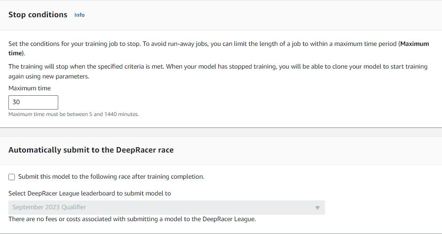

# Guía de inicio rápido a AWS DeepRacer

## Crea tu usuario personalizado

Creemos tu nombre de usuario en AWS DeepRacer 🚗. Pero no te preocupes, si no sabes cómo encontrarlo o personalizarlo, te dejamos una pequeña guía.

[Link de la guía](https://catalog.workshops.aws/deepracer-200l/es-US/02-getting-started-with-aws-deepracer/02-your-racer-profile)

Y descuida, hasta este punto no habrás generado ningún costo sobre tu cuenta de AWS.

## Crea tu primer modelo

### 1. Nombre del Modelo


### 2. Pista


### 3. Tipo de competencia


### 4. Algoritmo


### 5. Hiperparámetros


### 6. Tipo de acción


### 7. Lista de acciones


### 8. Vehículo


### 9. Función de recompensa

```python
def reward_function(params):
    '''
    Example of rewarding the agent to follow center line
    '''
    
    # Read input parameters
    track_width = params['track_width']
    distance_from_center = params['distance_from_center']
    all_wheels_on_track = params['all_wheels_on_track']
    speed = params['speed']
    SPEED_THRESHOLD = 1.5

    
    # Calculate 3 markers that are at varying distances away from the center line
    marker_1 = 0.1 * track_width
    marker_2 = 0.25 * track_width
    marker_3 = 0.5 * track_width
    
    # Give higher reward if the car is closer to center line and vice versa
    if distance_from_center <= marker_1:
        reward = 1.0
    elif distance_from_center <= marker_2:
        reward = 0.5
    elif distance_from_center <= marker_3:
        reward = 0.1
    else:
        reward = 1e-3  # likely crashed/ close to off track
    
    
    if not all_wheels_on_track:		
        reward = 1e-3  # Penalize if the car goes off track
    elif speed < SPEED_THRESHOLD:		
        reward *= 0.5  # Penalize if the car goes too slow


    return float(reward)
```

### 8. Condición de finalización

